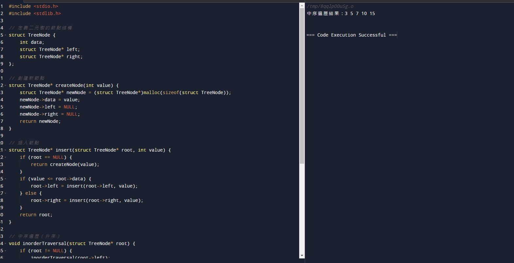

# GenAI_Algorithm_lab1 ==> 二元搜尋樹的各種實作(heap sort)
- `提問詞`:請寫出二元搜尋樹的演算法
- `提問詞`:請計算二元搜尋樹演算法的時間複雜度
- `提問詞`:請用Python寫出二元搜尋樹的演算法
- `提問詞`:請用C寫出二元搜尋樹的演算法
- `提問詞`:請用C++寫出二元搜尋樹的演算法
- `提問詞`:請用JAVA寫出二元搜尋樹的演算法
- `提問詞`:請用Rust寫出二元搜尋樹的演算法
- `提問詞`:請用go寫出二元搜尋樹的演算法
- `提問詞`:請用C#寫出二元搜尋樹的演算法
- `提問詞`:請用Javascript#寫出二元搜尋樹的演算法

# 當然可以！二元搜尋樹（Binary Search Tree，簡稱 BST）是一種常見的資料結構，它具有以下特性：

每個節點最多有兩個子節點：左子節點和右子節點。
左子節點的值小於等於父節點的值。
右子節點的值大於父節點的值。
每個子樹都是一個二元搜尋樹。
以下是用 C 語言實作二元搜尋樹的基本演算法：
#include <stdio.h>
#include <stdlib.h>

// 定義二元樹的節點結構
struct TreeNode {
    int data;
    struct TreeNode* left;
    struct TreeNode* right;
};

// 創建新節點
struct TreeNode* createNode(int value) {
    struct TreeNode* newNode = (struct TreeNode*)malloc(sizeof(struct TreeNode));
    newNode->data = value;
    newNode->left = NULL;
    newNode->right = NULL;
    return newNode;
}

// 插入節點
struct TreeNode* insert(struct TreeNode* root, int value) {
    if (root == NULL) {
        return createNode(value);
    }
    if (value <= root->data) {
        root->left = insert(root->left, value);
    } else {
        root->right = insert(root->right, value);
    }
    return root;
}

// 中序遍歷（升序）
void inorderTraversal(struct TreeNode* root) {
    if (root != NULL) {
        inorderTraversal(root->left);
        printf("%d ", root->data);
        inorderTraversal(root->right);
    }
}

int main() {
    struct TreeNode* root = NULL;
    root = insert(root, 10);
    root = insert(root, 5);
    root = insert(root, 15);
    root = insert(root, 3);
    root = insert(root, 7);

    printf("中序遍歷結果：");
    inorderTraversal(root);
    printf("\n");

    return 0;
}

